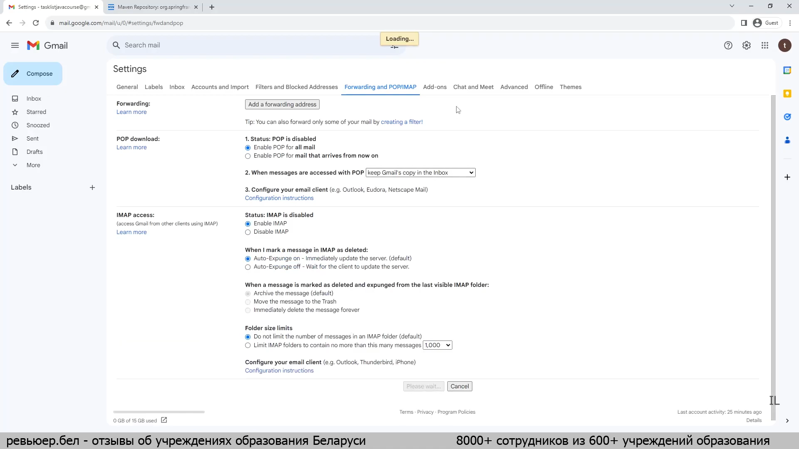

<<<<<<< HEAD
# education2-system
## Система управления обучением (Education Management System)

## Запуск
```bash
docker-compose up -d
```

```bash
mvn spring-boot:run
```

### 1. Создайте базу данных education в PostgreSQL
Вам нужно вручную создать базу данных education в PostgreSQL. Для этого выполните следующие шаги:

Подключитесь к контейнеру PostgreSQL:
```bash
docker exec -it postgres psql -U postgres
```
Создайте базу данных education:
```sql
CREATE DATABASE education;
```
Проверьте, что база данных создана:
```sql
\l
```
Выйдите из PostgreSQL:
```sql
\q
```

Настройка почты


## Crontab.guru
сайт cron
=======
# education-management-system
Система управления обучением (Education Management System)
>>>>>>> 0ef05366575be202973a0aa7b57a4de45d274700
